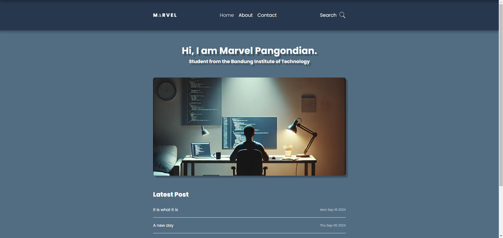
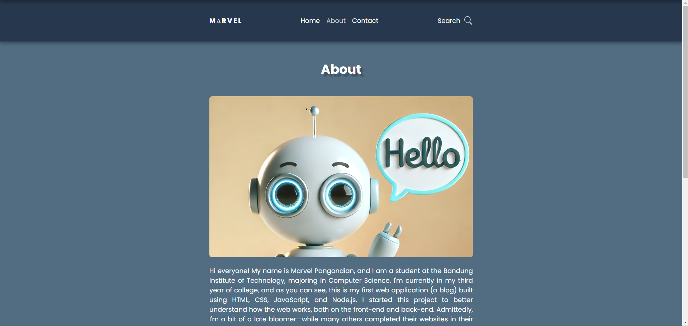
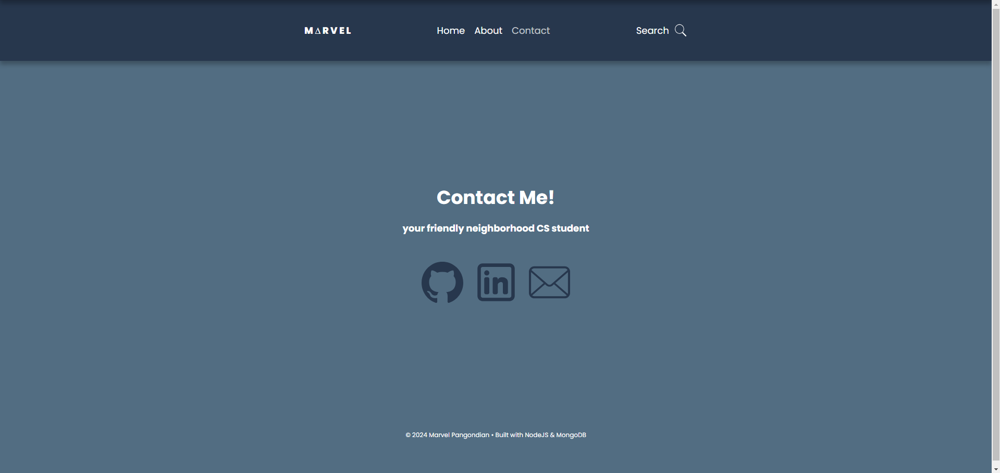
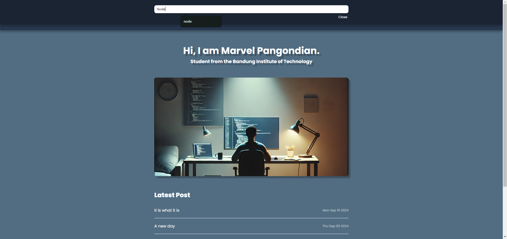
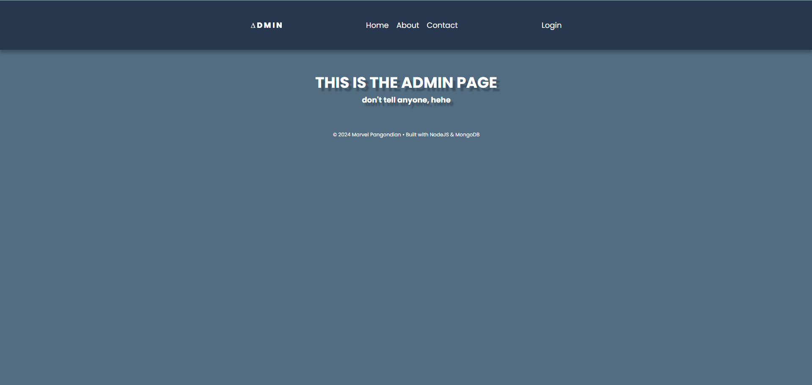
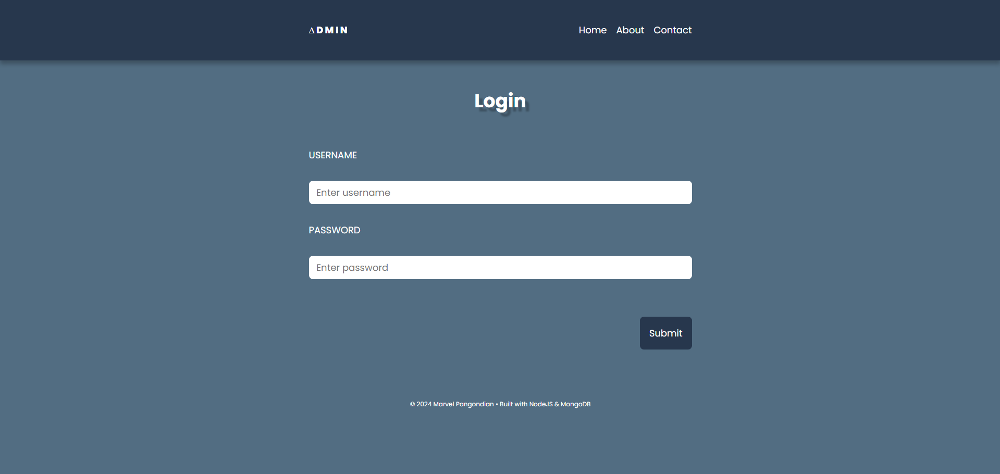
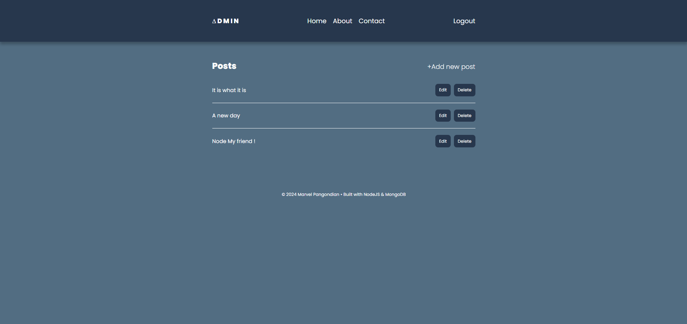

# Personal Blog
> A simple Blog using html, css, javascript, and express
## Table of contents
* [Table of Contents](#table-of-contents)
* [Preview](#preview)
* [Description](#description)
* [Run program](#how-to-run)
* [Access Admin Page](#access-admin-page)
* [Tech Stack](#tech-stack)
* [Author](#author)


## Preview

 <br/><br/>
<br/><br/>
<br/><br/>
<br/><br/>
<br/><br/>
<br/><br/>
<br/><br/>

## Description

A simple blog built using HTML, CSS, JavaScript, and Express. This blog utilizes MongoDB and includes CRUD (Create, Read, Update, Delete) functionality for each post. Creating, editing, and deleting posts can only be done on the admin page (GET /admin), and only the creator has an account (with a username and password) to access the admin dashboard.

## Run Program

1. Clone repository

    ```powershell
    git clone https://github.com/MarvelPangondian/Blog-project
    ```
2. Install NPM packages
    ```powershell
      npm install
    ```

3. Create a `.env` file in the root of the project.

4. Configure you're MONGODB_URI and SECRET_KEY in said `.env` file

    ```env
    MONGODB_URI = your_mongodb_uri
    SECRET_KEY = your_secret_key
    ```
5. Run program using npm
    ```powershell
    npm start
    ```

## Access Admin Page

1. The admin page can be accessed at `GET /admin`.

2. To access the admin page, the user needs to create their own username and password in their MongoDB database.

3. To create your own username and password, the user can use the following command:

    ```powershell
    npm run create-user <username> <password>
    ```

4. AAfter creating your user account, navigate to the admin page. If you're running the program locally, you can access the login page at [http://localhost:3000/admin/login](http://localhost:3000/admin/login)


5. After logging in, the user can create, edit, and delete posts.


## Tech Stack

1. HTML

2. CSS

3. Javascript

4. Node.js

5. Express.js

6. NPM


## Author
Name: Marvel Pangondian <br>
Profile Github: [MarvelPangondian](https://github.com/MarvelPangondian)
